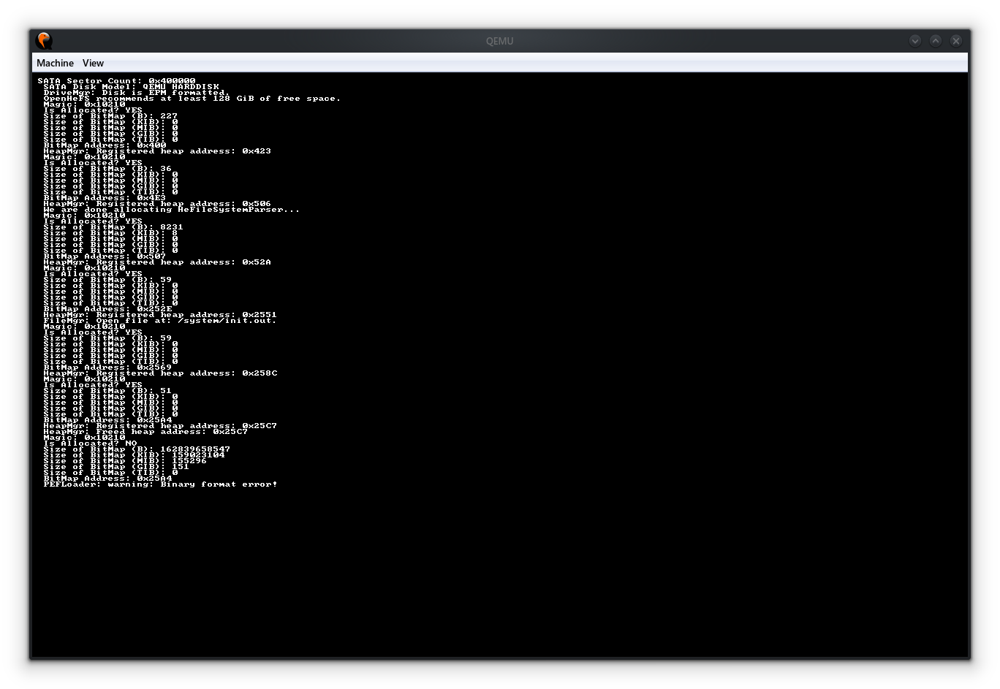

<!-- Read Me of NeKernel -->

# 🍯 The NeKernel

<a href="https://github.com/ne-foss-org/nekernel/actions/workflows/boot-ahci-dev.yml/badge.svg"></a>
<a href="https://github.com/ne-foss-org/nekernel/actions/workflows/kernel-ahci-dev.yml/badge.svg"></a>
<a href="LICENSE"></a>


## About:

The Base OS of the NeSystem designed for portability and scalability. A hybrid system written in modern C++ for backend systems. 

## Getting Started:

### **Requirements**:

- [MinGW](https://www.mingw-w64.org/)
- [Clang](https://clang.llvm.org/)
- [NASM](https://nasm.us/)
- [NeBuild](https://github.com/ne-foss-org/nebuild)
- CoreUtils
- [Git](https://git-scm.com/)
- [Nectar](https://github.com/ne-foss-org/nectar)

### **Building & Running**

Please fork, and clone the repository. Then follow those steps:

```sh
git clone -j8 https://github.com/ne-foss-org/nekernel.git
cd nekernel
./scripts/setup_x64_project.sh
./scripts/modules_ahci_x64.sh
./scripts/debug_ahci_x64.sh   # For debug generic AHCI target (QEMU, UDF)
```

---

## Community:

Join our [Discord](https://discord.gg/uD76Qweght), we're quite active and open for contributors!

## Structure

- `src/kernel/` — Hybrid Kernel sources (SwapKit, KernelKit, SMP, Memory, FileMgr)
- `src/boot/` — Bootloader and Boot modules sources (BootKit, modules, EFI/NeBoot bring-up)
- `src/libDDK/` — Driver Development Kit (DDK)
- `src/libSystem/` — Userland system call interface and runtime
- `src/launch/` — NeKernel Launch System.
- `src/libMsg/` — NeKernel OpenMSG framework.
- `public/tools/` — CLI tools (mkfs, chk, open, manual, etc.)
- `public/frameworks/` — Userland frameworks (CoreFoundation, DiskImage, etc.)
- `doc/` — Specifications, design docs, requirements, and diagrams.

---

## Design Rationale:

The sources are designed to be modular and gracefully error when needed.

Modern C/C++ is also used to implement the system, alongside assembly stubs in the HAL.

---

## Security

- **Vulnerability Disclosure:**  
  Please report security issues privately via email or GitHub Security Advisories.

---

## Documentation

- [Documentation](https://docs.src.nekernel.org/)
- [Specifications](doc/tex/)

---

## Contributing

- Please run `format.sh` before committing (uses `.clang-format`).
- All contributions (code, docs, fuzzing, security) are welcome!

---

## Authors & Credits

- **Amlal El Mahrouss** — Lead and Kernel Architect.
- [Full contributor list](https://github.com/ne-foss-org/nekernel/graphs/contributors)

---

## Citing

- Refer to [CITATION.cff](CITATION.cff)

---

## License

NeKernel is licensed under the [Apache-2.0 License](LICENSE).

---

## Figures:

#### Figure 1: The Hybrid Kernel booting




<div align="center">
  <sub>
    &copy; 2022-2026 Amlal El Mahrouss & Ne.app Authors. Licensed under the Apache 2.0 license.
  </sub>
</div>
